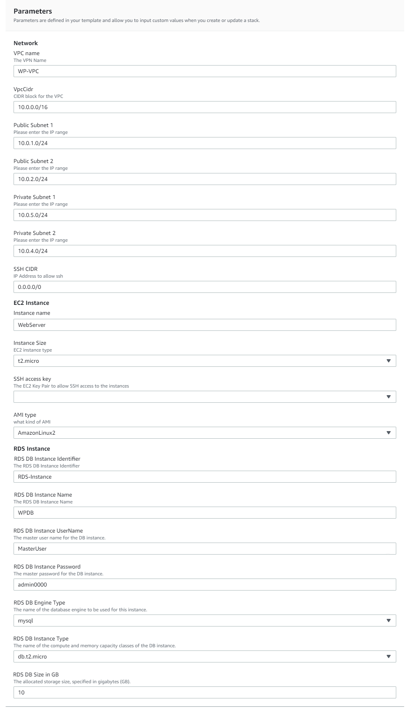

# **Hosting WordPress using AWS CloudFormation**

### Version 1.0.0

---

This reference architecture provides a set of YAML templates for deploying WordPress on AWS using [Amazon Virtual Private Cloud (Amazon VPC)](http://docs.aws.amazon.com/AmazonVPC/latest/UserGuide/VPC_Introduction.html), [Amazon Elastic Compute Cloud (Amazon EC2)](http://docs.aws.amazon.com/AWSEC2/latest/UserGuide/concepts.html), [Auto Scaling](http://docs.aws.amazon.com/autoscaling/latest/userguide/WhatIsAutoScaling.html), [Amazon Relational Database Service (Amazon RDS)](http://docs.aws.amazon.com/AmazonRDS/latest/UserGuide/Welcome.html), [Amazon Route 53](http://docs.aws.amazon.com/Route53/latest/DeveloperGuide/Welcome.html) with [AWS CloudFormation](http://docs.aws.amazon.com/AWSCloudFormation/latest/UserGuide/Welcome.html).

## Schematic

The repository consists of a set of nested templates which are run in order from the master template. Run the master template to create the entire stack, entering the appropriate parameters. Nested templates can be run individually in order, entering the appropriate input parameters for each stack.
## Parameters

## Steps to Run
To launch the entire stack and deploy a WordPress site on AWS, click on one of the ***Launch Stack*** links below or download the Master template and launch it locally.

You can use your account to lunch 

You can launch this CloudFormation stack, using your account, in the following AWS Regions:

| AWS Region Code | Name | Launch |
| --- | --- | --- 
| us-east-1 |US East (N. Virginia)|  |
| us-east-2 |US East (Ohio)|  |
| us-west-2 |US West (Oregon)|  |
| eu-west-1 |EU (Ireland)|  |
| eu-central-1 |EU (Frankfurt)|  |
| ap-southeast-2 |AP (Sydney)|  |

### AWS Resources Created:

- Amazon Virtual Private Cloud (Amazon VPC)
- Internet Gateway (IGW)
- NAT Gateway (across all public subnets)
- Amazon VPC subnets (public, private )  in all the Availability Zones (AZs) selected
- Routing tables for public subnets - routing through IGW
- Routing tables for private subnets - routing through NAT Gateway
- Multiple VPC Security Groups
- Amazon Relational Database Service (Amazon RDS) Aurora cluster - in private subnets (data)
- Amazon Elastic Compute Cloud (Amazon EC2) instance
- Amazon Route53 DNS record set 

### Input Parameters

#### Network
- VPC name
- VPC CIDR block
- CIDR block for public subnets 1 and 2
- CIDR block for private subnets 1 and 2
- SSH Access CIDR block

#### EC2 Instance
- EC2 instance name
- EC2 instance size
- EC2 Key Name Pair
- AMI type

#### Database 
- Database instance identifier 
- Database Name
- Database Master Username
- Database Master Password
- Database engine type
- Database Instance Class Type
- Database Size

## Master Template
The master template receives all input parameters and passes them to the appropriate nested template which are executed in order based on dependencies.
Review the template here [Wp-Master.yaml](templates/Wp-Master.yaml)

## Network infrastructure 
Review the template here [Wp-VPC.yaml](templates/Wp-VPC.yaml)

### Default VPC and subnet IP ranges

| Item | CIDR Range | Usable IPs | Description |
| --- | --- | --- | --- |
| VPC | 10.0.0.0/16 | 65,536 | The whole range used for the VPC and all subnets |
| Public Subnet | 10.0.1.0/24 | 254 | Public subnet in first Availability Zone |
| Public Subnet | 10.0.2.0/24 | 254 | Public subnet in second Availability Zone |
| Private Subnet | 10.0.3.0/24 | 254 | Private subnet in third Availability Zone |
| Private Subnet | 10.0.4.0/24 | 254 | Private subnet in fourth Availability Zone |

## Security Groups Template
Review the template here [Wp-SecurityGroups.yaml](templates/Wp-SecurityGroups.yaml)

## Amazon RDS Template
Review the template here [Wp-RDS.yaml](templates/Wp-RDS.yaml)

## Amazon EC2 instance
Review the template here [Wp-EC2.yaml](templates/Wp-EC2.yaml)

## Amazon Route 53 Template
Review the template here [Wp-Route53.yaml](templates/Wp-Route53.yaml)

